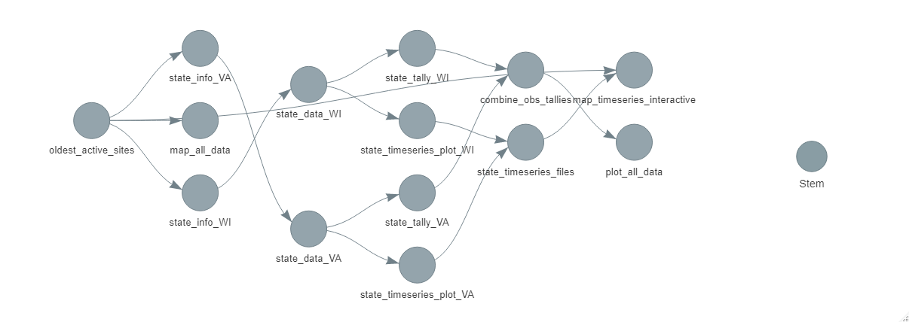

I used this repo to try out the [`targets`](https://books.ropensci.org/targets/index.html) package by following along with the DS Pipelines courses. I saved the result of each of the pipelines courses in separate branches.

To follow along, I couldn't do the actual course in Git Learning Lab because I wasn't going to complete the exact steps it wanted me to complete. Instead, I followed along with the steps by manually stepping through the `.md` files. 

* [ds-pipelines-1 steps](https://github.com/USGS-R/ds-pipelines-1-course/tree/master/responses)
* [ds-pipelines-2 steps](https://github.com/USGS-R/ds-pipelines-2-course/tree/master/responses)
* [ds-pipelines-3 steps](https://github.com/USGS-R/ds-pipelines-3-course/tree/master/responses)

# How I setup pipelines-3

I had already completed [the actual GitHub Learning Lab course](https://lab.github.com/USGS-R/scipiper-tips-and-tricks), so I went to [my course repo](https://github.com/lindsayplatt/ds-pipelines-3) and copied the `scipiper` pipeline code needed into this repo. I copied all of the `src/` files, the `remake.yml`, and the `123_state_tasks.R` file. Then, I was ready to convert the `scipiper` pipeline into a `targets` pipeline. When finished, I deleted `remake.yml` and `123_state_tasks.R` because they were not needed.

# Build pipelines-3

I wrote code that recreates the pipeline from ds-pipelines-3 using `targets`. I didn't not recreate EXACTLY because I took some liberties when it came to translating the task table into a `targets` `tar_map` step for what would make the most sense. Overall, I found that the `targets` code is much more concise than the scipiper pipeline code. I kept all targets in the `_targets.R` file this time around.

There are 6 top-level targets (`oldest_active_sites`, `combine_obs_tallies`, `state_timeseries_files`, `plot_all_data`, `map_all_data`, and `map_interactive_timeseries`. In the `tar_map` command, there are 4 targets per state (`state_info`, `state_data`, `state_timeseries_plot`, and `state_tally`). In the end (ignoring the files saved in `1_fetch/tmp` and `3_visualize/tmp`), three files should build: `3_visualize/out/data_coverage.png`, `3_visualize/out/site_map.png`, and `3_visualize/out/timeseries_map.html`. Note that all of the directories need to be setup ahead of time; `tar_make()` will not create an `*/out/` or `*/tmp/` folders; it will throw an error if you don't have the correct directories.

Before running this pipeline, I tested that it was ready by changing `states` to only two states and then running `tar_glimpse()` to investigate that all of the connections are appropriately setup. I get the following:



Then, I built the pipeline by running the code below:

```r
library(targets)
tar_make()
```

Once it built, I added `NY` to `states` and checked what would update by running `tar_visnetwork()`. I got the following:


